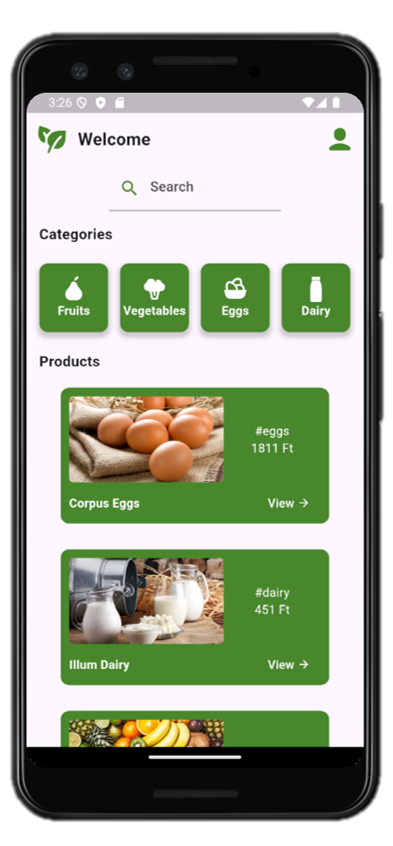

# farmertocustomer
This repository is a part of a group project "Direct Farmers to Consumers Market" of the 2024-25-1 Advanced Software Technology course of ELTE Faculty of informatics.

## Running the application

In this section, we will discuss how to run the application in debug mode on **Android emulator** on a Windows machine.

### Prerequisites
- [Node.js](https://nodejs.org/en/download/package-manager)
- [Android Studio](https://developer.android.com/studio)
- [Flutter](https://docs.flutter.dev/get-started/install/windows/mobile)

### Backend

The following commands should be run from the `./backend` folder.

1. Run `npm i` to install required dependencies.
2. Copy the _.env.example_ file, rename it to _.env_, and modify the environment variables if needed.
3. Run `npm db-seed` to create and seed the _.sqlite_ database file with some test data.
4. Run `node index.js` to start the server.

After starting the server, you should see the following message in your terminal:

> 🚀 Server is listening on http://[::1]:3000

### Frontend

1. Open Android Studio, and open Virtual Device Manager.
2. Add a Pixel 3 device with API 35, and cold boot the emulator.
3. Run `flutter devices` to list available devices. You should see the emulator listed with an ID similar to `emulator-XYZW`.
4. From the `./frontend` folder, run `flutter run -d [emulator id]`.

After running the command, you should see the application on the emulator.

